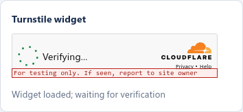
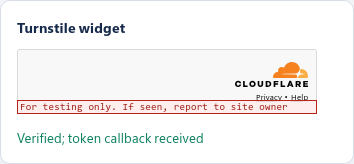
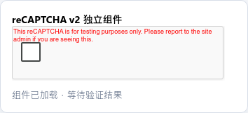
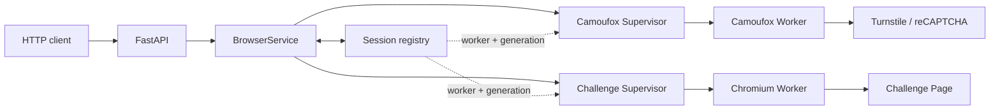

# Camoufox Session Service

[](https://github.com/heidashuai-maker/camoufox-session-service/actions/workflows/ci.yml)


一个面向浏览器验证场景的小型 HTTP 服务。它把 Camoufox 和 Chromium 放进受监管的 Worker 进程，为 Turnstile、reCAPTCHA v2、Cloudflare Challenge Page 以及后续 Session 复用提供统一 API。

项目可以独立运行，不依赖早期的 `turnstile-token-service`，也不需要 Node.js、Puppeteer、Selenium 或 FlareSolverr。

## 能力与引擎

| 场景 | 引擎 | 返回内容 |
| --- | --- | --- |
| Turnstile 独立组件或页面组件 | Camoufox | Token、Cookie、User-Agent |
| reCAPTCHA v2 复选框/音频流程 | Camoufox | Token、Cookie、User-Agent |
| Cloudflare Challenge Page | DrissionPage + Chromium | 页面状态、Cookie、可选 HTML |
| 挑战后的连续访问 | 原浏览器 Context | `sessionId`、页面内容、更新后的 Cookie |

Camoufox 更适合组件级验证；整页 Managed Challenge 使用 Chromium。两个引擎各自拥有独立的进程池，但共用同一套队列、硬超时、Worker 回收、Session 绑定和运行指标。

### 真实组件截图

以下图片由项目代码在 Linux Docker 环境中使用官方测试密钥生成，未写入 Token 或 Cookie。

| Turnstile 加载 | Turnstile 完成 |
| --- | --- |
|  |  |



官方测试密钥只用于验证组件加载、回调捕获和资源清理，不代表真实站点通过率。

## 快速开始

Docker 是最省事的运行方式，镜像已包含 Camoufox、Chromium、Xvfb、FFmpeg 和最小 init 进程。

```bash
cp .env.example .env
docker compose up -d --build
curl http://127.0.0.1:3000/health/ready
```

就绪响应：

```json
{
  "status": "ready",
  "workers": {
    "camoufox": [22],
    "challenge": [115]
  }
}
```

接口文档位于 `http://127.0.0.1:3000/docs`。

本地开发：

```bash
python -m venv .venv
. .venv/bin/activate
python -m pip install -e ".[test]"
python -m camoufox fetch
python -m camoufox_service
```

## API

| 方法 | 路径 | 用途 |
| --- | --- | --- |
| `POST` | `/v1/turnstile/solve` | 加载 Turnstile 独立组件或真实页面组件 |
| `POST` | `/v1/recaptcha/v2/solve` | 执行 reCAPTCHA v2 流程 |
| `POST` | `/v1/challenge/solve` | 处理整页 Cloudflare Challenge |
| `POST` | `/v1/sessions` | 创建 Camoufox Session |
| `GET` | `/v1/sessions` | 查看当前 Session |
| `POST` | `/v1/sessions/{id}/request` | 在原浏览器身份内继续请求 |
| `DELETE` | `/v1/sessions/{id}` | 关闭 Context 并删除 Session |

### Turnstile 独立组件

```bash
curl -X POST http://127.0.0.1:3000/v1/turnstile/solve \
  -H "Content-Type: application/json" \
  -d '{
    "url": "https://authorized.example/",
    "siteKey": "SITE_KEY",
    "strategy": "minimal"
  }'
```

`minimal` 在目标 Origin 下加载独立 Widget；`page` 访问真实页面并读取页面已有的 Widget。

### reCAPTCHA v2

```bash
curl -X POST http://127.0.0.1:3000/v1/recaptcha/v2/solve \
  -H "Content-Type: application/json" \
  -d '{
    "url": "https://authorized.example/captcha",
    "sessionUrl": "https://authorized.example/",
    "siteKey": "SITE_KEY",
    "maxAudioAttempts": 3
  }'
```

当前范围是 v2 复选框与音频流程，不包含 v3 和 Enterprise。

### Challenge Page 与 Session 复用

```bash
curl -X POST http://127.0.0.1:3000/v1/challenge/solve \
  -H "Content-Type: application/json" \
  -d '{
    "url": "https://authorized.example/",
    "proxy": "socks5h://proxy.example:8501",
    "retainSession": true,
    "ttlSeconds": 900
  }'
```

设置 `retainSession:true` 后，成功结果会包含 `sessionId`。后续 GET 请求继续使用原 Chromium Context，因此代理、Cookie、缓存和网络指纹不会发生切换：

```bash
curl -X POST http://127.0.0.1:3000/v1/sessions/SESSION_ID/request \
  -H "Content-Type: application/json" \
  -d '{"method":"GET","url":"https://authorized.example/","returnHtml":true}'
```

Challenge Session 当前只支持 GET。使用结束后应调用：

```bash
curl -X DELETE http://127.0.0.1:3000/v1/sessions/SESSION_ID
```

## 工作方式



每个 Worker 长期持有一个浏览器进程。普通任务创建临时 Context；保留 Session 时，Context 会绑定到创建它的 Worker 和 generation。Worker 一旦重启，旧 Session 返回 HTTP 410，不会静默换成新的浏览器身份。

## 配置与资源

完整默认值见 [`.env.example`](.env.example)。常用配置分为四组：

- `CAMOUFOX_*`：组件 Worker 数量、队列、超时和回收阈值。
- `CHALLENGE_*`：Chromium Worker 数量、队列、超时和回收阈值。
- `CAMOUFOX_SESSION_TTL_SECONDS`：Session 默认有效期。
- `WORKER_STREAM_LIMIT_BYTES`：Worker 单条 JSON 响应上限，默认 16 MiB。

`AUTH_TOKEN` 非空时，业务接口和 `/metrics` 需要 `Authorization: Bearer <token>`。

浏览器 Worker 会占用较多内存。Compose 默认限制容器使用 4 GiB；增加 Worker 数量前，应先根据 `/metrics` 中的 RSS 数据调整容器上限。

## 开发与测试

```bash
python -m ruff check .
python -m ruff format --check .
python -m pytest -q
python -m build
```

默认测试不访问受保护站点。浏览器集成测试需显式启用：

```bash
RUN_BROWSER_TESTS=1 python -m pytest tests/test_browser_integration.py -q
RUN_CHALLENGE_BROWSER_TESTS=1 python -m pytest tests/test_challenge_browser_integration.py -q
```

## 使用边界

- Token 通常短期、单次有效，仍需由目标站点服务端验证。
- `cf_clearance`、User-Agent 和代理出口属于同一浏览器身份，不能随意拆开复用。
- 普通 HTTP 客户端可能因 TLS 指纹不同而再次触发挑战。`curl_cffi` 可作为优化路径，但应保持同一代理并导入完整 Cookie 集；仅使用 `JSESSIONID` 不够。
- Challenge 是否通过取决于站点策略、代理质量和浏览器身份，本项目不承诺固定通过率。
- 请只用于自有系统或已明确授权的目标。

## 设计参考

项目参考了 [Camoufox](https://github.com/daijro/camoufox)、[FlareSolverr](https://github.com/FlareSolverr/FlareSolverr) 和 [cf-clearance-scraper](https://github.com/ZFC-Digital/cf-clearance-scraper) 的浏览器生命周期与 Session 思路，但代码、API 和 Worker 模型均为本项目独立实现。

## License

[MIT](LICENSE)
