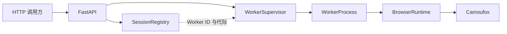

# 系统架构

本文说明 `camoufox-session-service` 的核心组件、任务链路、Session 复用方式和故障恢复边界。接口示例与部署步骤见项目根目录的 `README.md`。

## 组件关系

- **FastAPI**：校验请求、执行可选鉴权、映射异常，并把浏览器任务交给 Supervisor。
- **WorkerSupervisor**：负责有界队列、Worker 选择、单 Worker 锁、硬超时、进程替换和回收指标。
- **WorkerProcess**：维护 API 进程与 Worker 子进程之间的 JSONL 请求/响应协议。
- **BrowserRuntime**：运行在 Worker 子进程内，独占一个 Camoufox 实例并管理持久浏览器上下文。
- **SessionRegistry**：保存在 API 进程内的轻量元数据，只记录 Session 与 Worker 的绑定关系，不保存浏览器对象。

## 任务链路

1. 调用方向 FastAPI 发送类型化请求。
2. Supervisor 检查队列容量，取得 admission 名额。
3. Supervisor 选择 Worker，并取得该 Worker 的互斥锁。
4. WorkerProcess 通过标准输入发送一行 JSON 请求。
5. Worker 子进程中的 BrowserRuntime 执行 Turnstile、reCAPTCHA、Challenge 或 Session 操作。
6. Worker 通过标准输出返回一行 JSON，API 将结果转换为统一响应模型。
7. Supervisor 释放 Worker 锁和 admission 名额，并判断 Worker 是否达到回收阈值。

Turnstile `minimal` 策略会拦截目标文档请求并返回本地 Widget HTML，但仍使用调用方 URL 的 Origin；`page` 策略直接访问真实页面并读取已有组件。整页 Challenge 接口只根据页面证据归类状态，不承诺通过 Managed Challenge。

## Session 复用链路

创建 Session 时，API 先选择一个 Worker，再让该 Worker 创建持久 Browser Context。Registry 记录：

- `sessionId`
- `workerId`
- `workerGeneration`
- 创建时间和过期时间

后续请求必须回到同一 Worker 和同一 generation。Cookie、User-Agent、代理身份和浏览器上下文因此保持成套复用。如果 Worker 崩溃或被回收，generation 会增加，旧 Session 返回 HTTP 410，避免请求在调用方不知情时切换浏览器身份。

Cookie 能否让后续请求继续访问目标，取决于 Cookie 本身是否有效，以及 User-Agent、代理出口和站点策略是否保持一致。Cloudflare 官方 Dummy Key 只验证浏览器与 Widget 链路，不代表真实站点通过率。

## 超时与崩溃恢复

- **有界队列**：等待任务超过 `CAMOUFOX_QUEUE_SIZE` 时快速拒绝，避免无上限堆积。
- **硬超时**：任务超过 `CAMOUFOX_TASK_TIMEOUT_SECONDS` 后，不继续复用状态未知的 Worker。
- **进程树回收**：Supervisor 终止 Worker 及其浏览器后代进程，避免遗留 Camoufox 进程。
- **Worker 替换**：旧进程停止后创建同槽位的新 Worker，并递增 generation。
- **主动回收**：任务数、生存时间或 RSS 达到阈值后，在任务边界替换 Worker。
- **浏览器崩溃**：Worker 将浏览器断连升级为协议错误，Supervisor 随后执行完整替换。

## 能力边界

- 本服务提供浏览器执行、状态观察和 Session 复用能力，不保证通过所有 CAPTCHA 或 Managed Challenge。
- Turnstile Token 不是长期凭据，调用方仍需按站点协议及时提交并进行服务端验证。
- `PHPSESSID`、`__cf_bm` 等普通 Cookie 不能替代有效的 `cf_clearance`。
- reCAPTCHA 音频流程可能受到语言、音频质量、速率限制和识别服务可用性的影响。
- 真实站点测试必须限定在自有系统或明确授权范围内。
