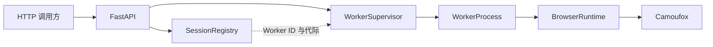

# Chinese Documentation Implementation Plan

> **For agentic workers:** REQUIRED SUB-SKILL: Use superpowers:subagent-driven-development (recommended) or superpowers:executing-plans to implement this plan task-by-task. Steps use checkbox (`- [ ]`) syntax for tracking.

**Goal:** 在不改变运行逻辑和 API 合约的前提下，为项目补齐中文 README、架构说明、配置注释和核心源码 docstring。

**Architecture:** 文档层负责项目定位、部署、调用方式和组件关系；源码层只在模块、关键类、关键函数及复杂并发边界增加职责型中文说明。所有程序标识、环境变量、API 字段、状态值、日志和异常文本保持英文。

**Tech Stack:** Markdown、Python 3.11、FastAPI、Camoufox、Ruff、pytest、PyPA build。

## Global Constraints

- 不改变 API 字段、枚举值、HTTP 错误文本和日志字段。
- 不改变求解策略、超时行为、资源限制或浏览器参数。
- 不新增运行依赖、国际化框架或语言切换配置。
- 注释解释职责、边界和设计原因，不重复代码动作。
- 不为测试函数逐个添加注释。
- 提交使用仓库级邮箱 `heidashuaui@gmail.com`，最终直接推送 `main`。

---

### Task 1: 中文用户文档与架构说明

**Files:**
- Modify: `README.md`
- Modify: `.env.example`
- Create: `docs/architecture.md`

**Interfaces:**
- Consumes: 当前 HTTP 路由、环境变量、Session 行为和 Docker 配置。
- Produces: 中文部署入口、API 使用说明、能力边界和组件关系说明。

- [ ] **Step 1: 将 README 完整翻译为中文**

保留所有命令、URL、JSON 字段和值，使用以下固定章节：

```markdown
# Camoufox Session Service
## 功能范围
## 环境要求
## 本地运行
## API
### Turnstile 最小组件
### reCAPTCHA v2 复选框与音频挑战
### 整页 Challenge
### 持久 Session
## 配置
## 测试
## Docker
## 能力边界
```

明确写出：官方 Dummy Key 只验证浏览器链路；Managed Challenge 不保证通过；Cookie 复用必须保持 User-Agent 和代理身份一致；Worker 重启后 Session 返回 HTTP 410。

- [ ] **Step 2: 新增中文架构文档**

写入以下数据流，并分别解释 Supervisor、Worker、Browser Context、Session Registry 的职责：



文档必须包含“任务链路”“Session 复用链路”“超时与崩溃恢复”“能力边界”四节。

- [ ] **Step 3: 为环境变量添加分组注释**

在 `.env.example` 中使用以下中文分组，不改变变量和值：

```dotenv
# HTTP 服务
# 可选鉴权；为空时不校验 Bearer Token
# Worker 与队列
# Session 与 Worker 回收
# 浏览器运行模式：true、false 或 virtual
```

- [ ] **Step 4: 验证文档差异**

Run: `git diff --check`

Expected: exit 0，无尾随空格或冲突标记。

Run: `rg -n "Managed Challenge|HTTP 410|User-Agent|Dummy" README.md docs/architecture.md`

Expected: README 和架构文档明确包含上述边界信息。

- [ ] **Step 5: 提交中文用户文档**

```bash
git add README.md .env.example docs/architecture.md
git commit -m "docs: add Chinese user documentation"
```

### Task 2: 基础设施模块中文 docstring

**Files:**
- Modify: `src/camoufox_service/app.py`
- Modify: `src/camoufox_service/browser.py`
- Modify: `src/camoufox_service/config.py`
- Modify: `src/camoufox_service/models.py`
- Modify: `src/camoufox_service/sessions.py`
- Modify: `src/camoufox_service/__main__.py`

**Interfaces:**
- Consumes: 现有函数签名、Pydantic 模型和 Session Registry 行为。
- Produces: 不影响运行时的中文模块、类和关键函数职责说明。

- [ ] **Step 1: 添加模块职责 docstring**

每个文件首行分别使用以下说明：

```python
"""FastAPI 应用装配、鉴权、异常映射与 HTTP 路由。"""
"""浏览器启动参数、Cookie 导出与通用页面信息读取。"""
"""从环境变量加载并校验服务配置。"""
"""HTTP 请求、响应、Cookie、代理与浏览器选项模型。"""
"""内存 Session 元数据、Worker 绑定与过期回收。"""
"""命令行入口：读取配置并启动 Uvicorn。"""
```

- [ ] **Step 2: 添加关键对象 docstring**

覆盖以下对象，使用单句职责说明，不逐项复述参数：

```text
create_app: 组装依赖、生命周期、异常映射和所有 HTTP 路由。
Settings: 保存经过类型化和边界校验的运行配置。
StrictModel: 拒绝未声明字段的 API 基础模型。
ProxyConfig: 接收结构化代理信息并生成 Playwright server 地址。
BrowserOptions: 所有浏览器任务共享的 User-Agent、代理和 Cookie 选项。
TaskResult: 统一返回状态、令牌、Cookie、页面信息和错误详情。
SessionRecord: 记录 Session 所属 Worker、代际和过期时间。
SessionRegistry: 管理 Session 的创建、查询、删除和过期回收。
```

- [ ] **Step 3: 验证语法、格式与基础测试**

Run: `.\.venv\Scripts\python.exe -m compileall -q src`

Expected: exit 0。

Run: `.\.venv\Scripts\python.exe -m ruff check .`，然后运行 `.\.venv\Scripts\python.exe -m ruff format --check .`

Expected: 两个命令均 exit 0。

Run: `.\.venv\Scripts\python.exe -m pytest -q tests/test_models.py tests/test_sessions.py tests/test_api.py`

Expected: 所有选定测试通过。

- [ ] **Step 4: 提交基础设施注释**

```bash
git add src/camoufox_service/app.py src/camoufox_service/browser.py src/camoufox_service/config.py src/camoufox_service/models.py src/camoufox_service/sessions.py src/camoufox_service/__main__.py
git commit -m "docs: explain core service components in Chinese"
```

### Task 3: 求解器、Worker 与监管逻辑中文 docstring

**Files:**
- Modify: `src/camoufox_service/challenge.py`
- Modify: `src/camoufox_service/turnstile.py`
- Modify: `src/camoufox_service/recaptcha.py`
- Modify: `src/camoufox_service/recaptcha_audio.py`
- Modify: `src/camoufox_service/worker.py`
- Modify: `src/camoufox_service/supervisor.py`

**Interfaces:**
- Consumes: `TaskResult`、`BrowserRuntime`、JSONL Worker 协议和现有求解入口。
- Produces: Challenge、CAPTCHA、Worker 生命周期和故障恢复的中文维护说明。

- [ ] **Step 1: 添加模块职责 docstring**

使用以下职责边界：

```text
challenge.py: 整页 Cloudflare Challenge 证据检测与状态归类。
turnstile.py: Turnstile 最小组件和真实页面两种求解策略。
recaptcha.py: reCAPTCHA v2 复选框、Challenge Frame 与音频流程编排。
recaptcha_audio.py: 音频下载、格式转换、语音识别与文本规范化。
worker.py: Worker 子进程内的 Camoufox 生命周期、Session 和任务派发。
supervisor.py: Worker 子进程监管、队列准入、硬超时、替换与回收。
```

- [ ] **Step 2: 添加关键对象和函数 docstring**

覆盖以下对象，说明职责和关键边界：

```text
detect_challenge / solve_challenge
build_turnstile_html / solve_turnstile
FrameState / RecaptchaAudioSolver / RecaptchaV2Solver / solve_recaptcha
AudioChallengeProcessor
BrowserSession / BrowserRuntime / BrowserRuntime.handle / worker.main
WorkerProcess / WorkerSupervisor / WorkerSupervisor.request_with_worker
```

`solve_turnstile` 必须说明 minimal 保留目标 Origin、page 使用真实组件；`WorkerSupervisor.request_with_worker` 必须说明 admission、Worker 锁、硬超时与替换顺序。

- [ ] **Step 3: 只在复杂边界添加行内注释**

最多覆盖以下四类位置：

```text
页面路由拦截仍保留调用方 Origin。
Session 通过 Worker ID 与 generation 防止身份静默漂移。
硬超时后先终止完整进程树，再创建替代 Worker。
浏览器崩溃错误需要升级为 Worker 协议错误触发回收。
```

不得为简单赋值、循环、条件分支或测试代码添加解释性注释。

- [ ] **Step 4: 运行完整验证**

Run: `.\.venv\Scripts\python.exe -m ruff check .`

Expected: `All checks passed!`

Run: `.\.venv\Scripts\python.exe -m ruff format --check .`

Expected: 所有 Python 文件已格式化。

Run: `.\.venv\Scripts\python.exe -m pytest -q`

Expected: `33 passed, 1 skipped` 或更多通过项且 0 failed。

Run: `.\.venv\Scripts\python.exe -m build`

Expected: 成功生成 sdist 与 wheel。

- [ ] **Step 5: 提交求解器和监管说明**

```bash
git add src/camoufox_service/challenge.py src/camoufox_service/turnstile.py src/camoufox_service/recaptcha.py src/camoufox_service/recaptcha_audio.py src/camoufox_service/worker.py src/camoufox_service/supervisor.py
git commit -m "docs: explain browser task lifecycle in Chinese"
```

### Task 4: 无行为变更审计与发布

**Files:**
- Verify: `README.md`
- Verify: `.env.example`
- Verify: `docs/architecture.md`
- Verify: `src/camoufox_service/*.py`

**Interfaces:**
- Consumes: Tasks 1-3 的提交。
- Produces: 已验证并发布到 GitHub `main` 的中文可读版本。

- [ ] **Step 1: 审查差异范围**

Run: `git diff 0d9e844..HEAD --stat`

Expected: 只包含 README、环境示例、架构/计划文档和 Python 注释/docstring。

Run: `git diff --check 0d9e844..HEAD`

Expected: exit 0。

- [ ] **Step 2: 运行发布前检查**

Run: `.\.venv\Scripts\python.exe -m pip check`

Expected: `No broken requirements found.`

Run: 依次执行 `.\.venv\Scripts\python.exe -m ruff check .`、`.\.venv\Scripts\python.exe -m ruff format --check .`、`.\.venv\Scripts\python.exe -m pytest -q`、`.\.venv\Scripts\python.exe -m build`。

Expected: 全部 exit 0。

- [ ] **Step 3: 推送并验证 CI**

```bash
git push origin main
& "C:\Program Files\GitHub CLI\gh.exe" run list --repo heidashuai-maker/camoufox-session-service --limit 1
```

Expected: `main` 推送成功，最新 `ci` workflow 最终为 `success`。
